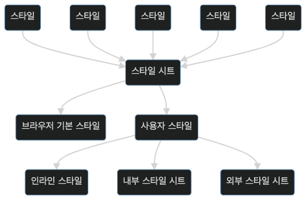

# CSS 요약 정리

## 👉🏻 &nbsp; 스타일과 스타일시트

|         종류         | 
설명
                               |
| :------------------: | :-------------------------------------------------- |
| 브라우저 기본 스타일 | 브라우저에서 기본으로 사용하는 스타일               |
|    인라인 스타일     | 요소에 스타일을 직접 지정                           |
|   내부 스타일 시트   | 문서 앞부분에 사용하는 스타일을 모아서 정의         |
|   외부 스타일 시트   | 사용하는 스타일을 모아서 따로 파일로 저장한 후 연결 |

 

## 👉🏻 &nbsp; CSS 기본 선택자

- 전체 선택자 : \* {}
- 타입 선택자 : p {}
- 클래스 선택자 : .container {}
- 아이디 선택자 : #yh { }

 

## 👉🏻 &nbsp; 스타일 우선 순위

1. 중요도
   - 사용자 스타일 -> 제작자 스타일 -> 브라우저 기본 스타일
2. 적용범위
   - !important -> 인라인 스타일 -> id 스타일 -> 클래스 스타일 -> 타입 스타일
3. 소스 작성 순서
   - 나중에 작성한 스타일이 먼저 작성한 스타일을 덮어쓴다.
