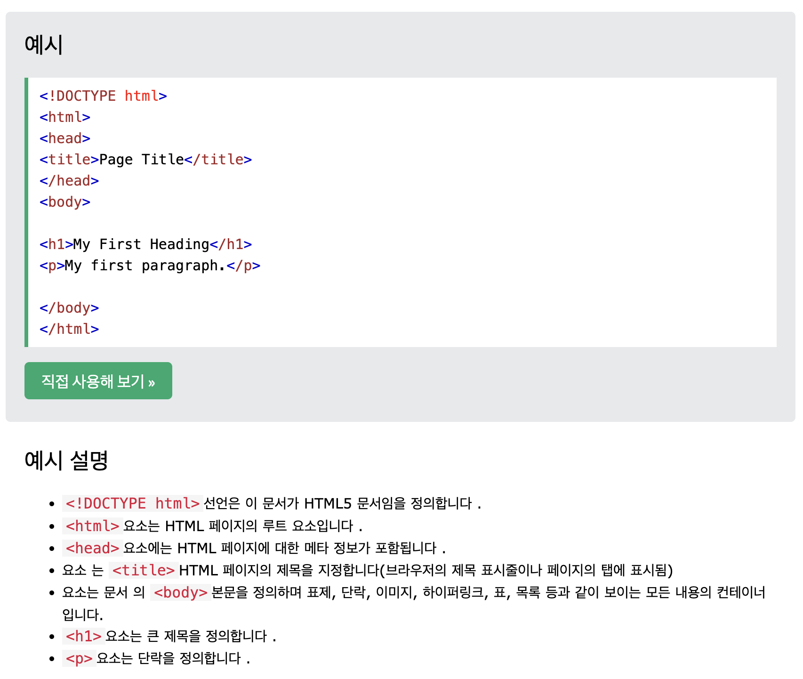
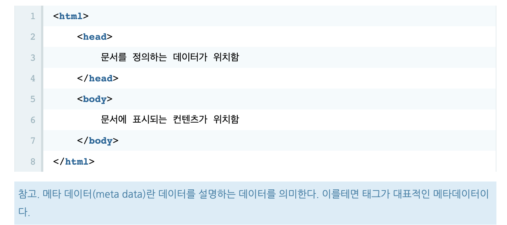

# HTML 기초 배우기

## HTML 소개

### HTML이란 무엇인가?

- HTML은 Hyper Text Markup Language의 약자이다.
  -> 문서와 문서가 링크로 연결
  -> 태그로 이루어진
  -> 언어

- HTML은 웹 페에지를 만들기 위한 표준 마크업 언어이다.
- HTML은 웹 페이지의 구조를 설명한다.
- HTML은 element로 구성된다.
- HTML element는 브라우저에게 content를 표시하는 방법을 알려준다.
- HTML element는 heading, paragraph, link와 같은 content에 레이블을 지정한다.
  -> 웹페이지를 만들기 위한 언어로 웹브라우저 위에서 동작하는 언어다.

### 간단한 HTML 문서

 

- html 문서는 파일의 확장자가 html 혹은 htm으로 끝난다.
- 최상위 태그로 html 사용
- 그 하위에 head 태그와 body 태그를 컨텐츠로 갖는다.
- head 태그에는 문서를 설명하는 태그로 제목이나 키워드 같은 정보를 담는다.
- body 태그에는 문서의 내용이 작성된다.

### HTML element란?

- HTML element는 시작 태그에서 종료 태그까지 전체

### 웹 브라우저

- 웹 브라우저의 목적은 HTML 문서를 읽고 올바르게 표시하는 것
