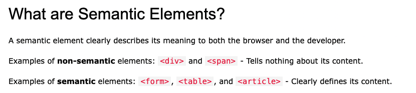
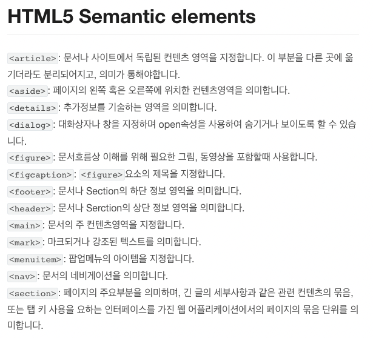

# 시맨틱 태그

## 시맨틱 태그란?

- semantic : "의미론적인", "의미가 통하는"
- Semantic Tag : 이름만 봐도 의미를 알수 있는 태그 (a , p, ... )

## 시맨틱 태그는 왜 필요할까?

- 웹 문서는 시맨틱 태그를 사용하지 않더라도 만들 수 있으며, 사용하든 하지 않든 웹 문서에 특별한 차이가 나지 않는다.

1. 시맨틱 태그를 사용하면 웹 브라우저가(뿐만 아니라 사람도...) HTML의 소스 코드만 보고도 웹페이지의 구조 파악이 가능하다.
   -> 시각 장애인이 웹 사이트를 이용할 때 쓰는 화면 낭독기와 같은 보조 기기에서 사이트의 구조를 제대로 이해할 수 있다.

2. 문서 구조가 정확히 나눠지므로 PC나 모바일의 웹 브라우저와 여러 스마트기기의 다양한 화면에서 웹 문서를 표현하기가 쉽다.

3. 인터넷에서 웹 사이트를 검색할 때 필요한 내용을 정확히 찾을 수 있다
   -> ex) 웹 사이트의 본문 내용을 검색해야 한다면 메뉴나 푸터 영역이 아니라 본문 영역 안에서만 검색

## 웹 문서 구조를 만드는 주요 시맨틱 태그

- 웹 문서의 구조를 만들 때 반드시 시맨틱 태그를 사용할 필요 없다. -> 시맨틱 태그 중 일부만 사용 O

- 하지만 문서 구조를 만드는 시맨틱 태그가 있다는 것을 알았다면 쓰임새에 맞는 태그를 사용하는 것이 좋다.

### 여러 소스를 묶는 div 태그

- division의 줄임말
- HTML의 시맨틱 태그가 나오기 전에는 헤더나 내이게이션 포터등을 구별할때 div를 사용했다
- id나 class 속성을 사용하여 문서 구조를 만들거나 스타일을 적용
- 영역을 구별하거나 스타일로 문서를 꾸밈

### 헤더 영역을 나타내는 header 태그

- 헤더 영역을 의미
- 주로 맨 위쪽이나 왼쪽에 존재
- 검색 창이나 사이트 메뉴를 삽입

### 내비게이션 영역을 나타내는 nav 태그

- 같은 웹 문서 안에서 다른 위치로 연결하거나 다른 웹 문서로 연결하는 링크를 만든다.
- 흔히 내비게이션을 만들 때 사용
- 웹 문서의 위치에 영향을 받지 않으므로 헤더나 푸터, 사이드 바안에 포함될 수도 있고 독립적으로 사용할 수도 있다.

### 핵심 콘텐츠를 담는 main 태그

- 웹 문서에 핵심이 되는 내용
- 메뉴, 사이드 바, 로고 처럼 페이지마다 똑같이 들어간 정보를 넣는 것은 XXXX
- 웹 문서마다 다르게 보여 주는 내용으로 구성
- main 태그는 웹 문서에서 한 번만 사용할 수 있음

### 독립적인 콘텐츠를 담는 article 태그

- 웹에서 실제로 보여 주고 싶은 내용을 넣는다.
- 블로그의 포스트나 뉴스 사이트의 기사처럼 독립된 웹 콘텐츠 항목
- 문서안에서 여러번 사용가능
- 내부에 section 태그를 넣을 수 있다.

### 콘텐츠 영역을 나타내는 section 태그

- 웹 문서에서 콘텐츠 영역을 담당
- section과 article은 비슷해 보이지만, section은 몇 개의 콘텐츠를 묶는 용도로 사용하고, article은 블로그의 포스트처럼 독립된 콘텐츠로 사용

### 사이드바 영역을 나타내는 aside 태그

- 본문 내용 외에 왼쪽이나 오른쪽, 혹은 아래쪽에 사이드 바를 만들때 사용
- 필수 요소는 아니므로 필요할 경우만 사용

### 푸터 영역을 나타내는 footer 태그

- 웹 문서에서 맨 아래쪽에 있는 푸터영역
- 사이트 제작 정보나 저작권 정보, 연락처 등을 넣는다.

## i vs em

- i : 시각적으로만 이탤릭체
- em : 강조하는 이탤릭체

## b vs strong

- b : 시각적으로만 볼드체
- strong : 정말 중요한 볼드체

## button vs a

- button : 특정한 액션 (로그인버튼, 컨텐츠 불러오기 버튼)
- a : 어디론가 이동할때 (링크)
