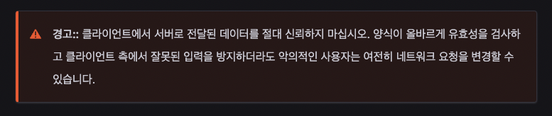

# 주제 : Form and Validations

- 서버에 데이터를 제출하기 전에 모든 폼이 올바른 형식으로 채워졌는지 확인하는 것이 중요
- 이를 Client-side validation 이라고 한다.
- 클라이언트 측에서 잘못 입력된 데이터를 포착해 사용자가 즉시 수정 가능
- 서버에서 발견하게 되면 눈에 띄게 시간이 지체된다.
- 그러나 클라이언트 측 유효성 검사는 철저한 보안조치로 간주되어선 안된다.
- 항상 서버측과 클라이언트측에서 제출 데이터에 대해서 항상 보안 검사를 수행해야한다.

## form validation

- 유명한 사이트들은 원하는 형식으로 데이터를 입력하지 않으면 피드백을 제공한다.

ex)
이 필드는 필수다.
"xxx-xxx" 형식으로 전화번호를 입력해라
유효한 이메일 주소를 입력해라
비밀번호는 8~30자 길이로, 대문자 1개, 기호 1개, 숫자 포함
등등

-> 이러한 것들을 양식 유효성 검사하고한다.

- 브라우저에서 수행되는 유효성 검사 : client-side form validation
- 서버에서 수행되는 유효성 검사 : server-side form validation

### 왜 for validation을 확인 해야하나?

- 올바른 형식으로 올바른 데이터를 얻기 위해
- 사용자의 데이터를 보호하기 위해
- 우리 자신을 보호하기 위해

## 다양한 유형의 Client-side Validations

1. 기본 제공 양식 유효성 검사 - HTML5 form validation 기능
2. JavaScript 유효성 검사 (직접정의 or 라이브러리)

### 기본 제공 form validation

- required : 꼭 채워야 하는 필드
- minlength, maxlength: 텍스트의 최소 및 최대
- min, max: 숫자 값의 최소값 및 최대값
- type : 숫자, 이메일, 주소, 기타...
- pattern : 입력된 데이터가 따라야하는 패턴 정의 -> 정규식 지정

Form : 사용자의 입력을 받아서 처리하는 양식을 뜻한다.
ex)
회원가입 양식
검색 양식
로그인
메시지 전송
구독 신청
-> 사용자로부터 입력받는 양식을 폼이라고 함

이름 : <input type="text">
 
input -> 입력
 
type="text" -> 사용자에게 텍스트를 입력 받는 양식을 만든것

- 대부분의 웹사이트에서는 이름부분을 누르면 input창에 커서가 생기게된다.
  그 이유는 두개가 연결되어있기때문인데
  이렇게 연결되어있는게 정석이고 반드시 그래야한다.
  위의 이름은 아무 의미가 없다.

그렇기 때문에 label 태그를 이용하고 인풋과 연결해줘야함

<label for="username"> 이름: </label>
<input type="text" id="username">

- for : 누굴위한 레이블인가?
- id : 유일무이한 이름
  라벨과 인풋을 정확하게 연결해야한다 - 명시적 코딩 (정석)

 

<label for="username1"> 이름: </label>
<input type="text" id="username1">
 
<label for="useremail"> 이메일: </label>
<input type="text" id="useremail">

 

type="text"이고 a를 입력 - 이메일 인풋에 이메일형식으로 입력하지않고 전송을 해버린다면?

<label for="username2"> 이름: </label>
<input type="text" id="username2">
 
<label for="useremail2"> 이메일: </label>
<input type="email" id="useremail2">
<input type="submit" value="전송">

- submit 타입을 만들고 전송을 눌러도 아무런 일이 발생하지 않는다.
- 왜냐하면 어디로 보낼 것인지 명시되어있지않기때문
- 그렇기 때문에 form 태그가 필요하다

<form action="#">
    <label for="username3"> 이름: </label>
    <input type="text" id="username3" required>
     
    <label for="useremail3"> 이메일: </label>
    <input type="email" id="useremail3">
    <input type="submit" value="전송">
</form>

- required : 입력을 안하면 안된다.
